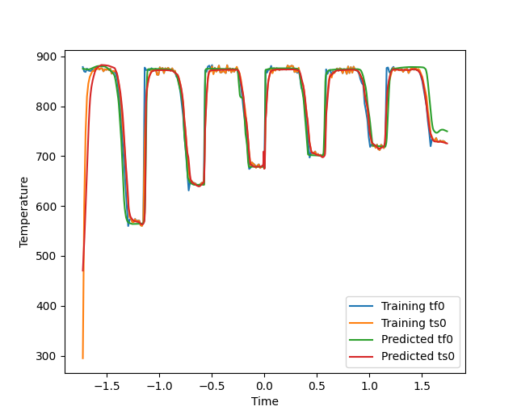

# Task 3
Given is a training set that consists of the time, fluid temperature and solid temperature.
The goal is to make predictions for the fluid and solid temperature given a testing set that consists of time samples.

## Problems overcome

- train two neural networks (one for the solid temperature and one for the fluid temperature)

## Best Model

