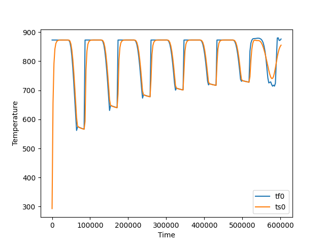

# Task 3

Comparable to [Task 1](https://github.com/lblum95/Deep_Learning_for_Scientific_Computing/tree/master/Project1/Project1/Task1)
the training set consists of the time, solid temperature and fluid temperature. For this task the goal is to create future predictions.

## Problems overcome
- Find a good model 
- Tried stateful and stateless LSTM, RNN and GRU
- Only stateful LSTM was able to create somewhat reasonable predictions

## Best Model
