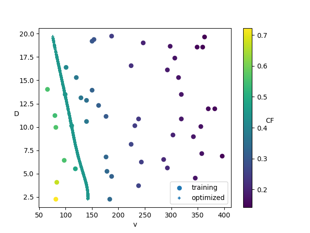

# Task 5

Given is a training set that consists of the diameter, volume and capacity factor.
The goal is to create 1000 minimizers (D*, v*) such that the capacity factor is 0.45.

## Problems overcome
- Define cost function for the optimization of the velocity => L2-norm
- Find a good model to predict the capacity factor from the diameter and the volume
- Find a good optimizer to find the optimal diameter D* and the opimal volume v*

## Best Model

